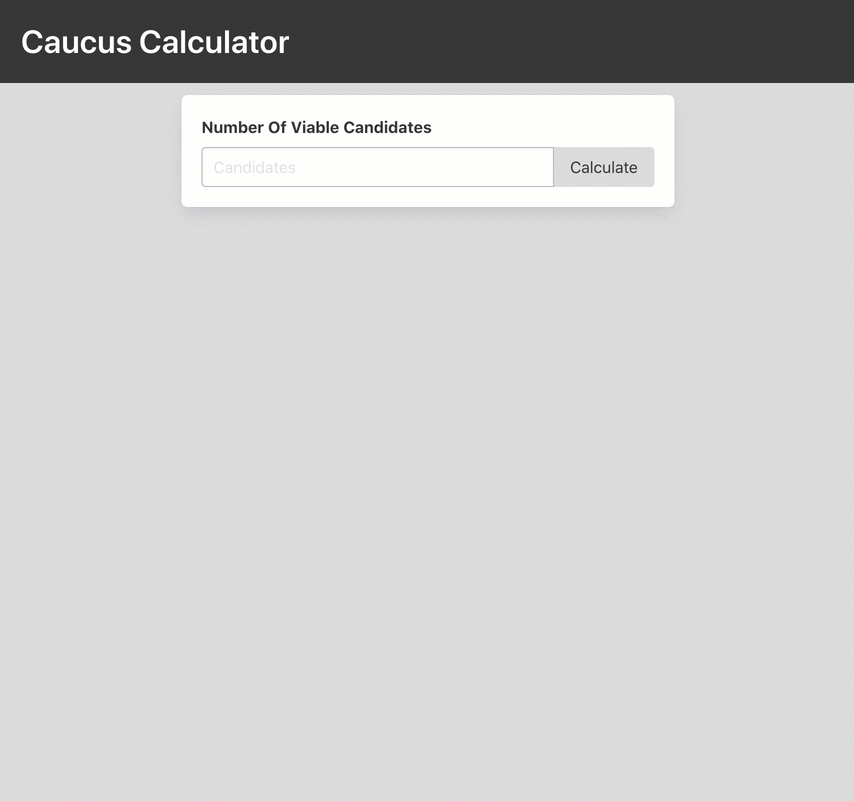

# Caucus Calculator
## Objective
Demonstrate use of Java + JSP, JSTL, Maven and Tomcat. This project calculates delegate allocation for a single caucus precinct.

__NOTE: This calculator ignores several (common) caucus scenarios__ (i.e. ties requiring specific rounding rules, coin flips, etc.). Going into the specifics of caucus delegate allocation would have been beyond the scope of the exercise.
